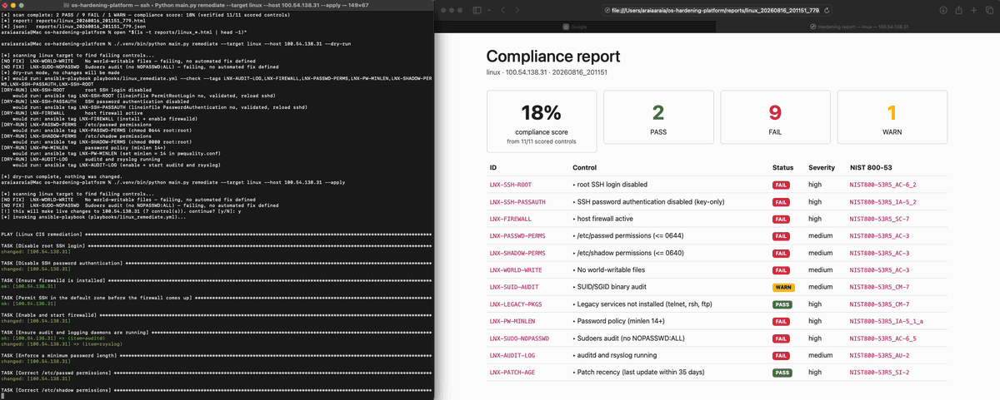
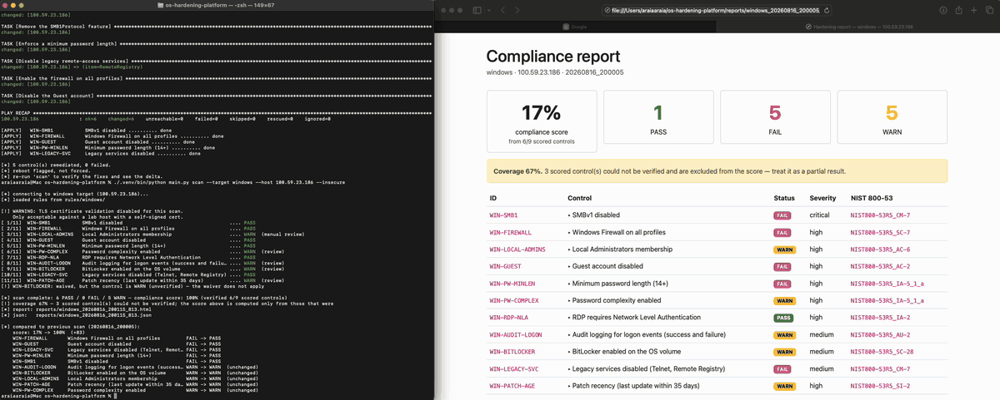

# OS Hardening Platform

A cross-platform compliance scanner that audits Windows Server and RHEL against CIS
benchmarks, scores only what it can actually verify, and remediates the gaps through
Ansible, reporting what it refuses to touch and why.

**What it actually does:**

- Scans Windows Server 2022 over WinRM and RHEL 9 over SSH from one codebase
- Reports PASS, FAIL, or WARN. Never a pass for anything it could not verify
- Tags every control to a CIS benchmark section and a NIST 800-53 control
- Remediates through Ansible on both platforms, dry-run by default, and names the controls it will not fix

**Example:** scans a stock Windows Server 2022 at 17% compliance. SMBv1 enabled, firewall
off, Guest account active. Fixes five of them through Ansible and reaches 100%, then reports
that three others could not be verified at all, because the scanning account deliberately
lacks the rights to read them.

## Live Demo

**RHEL 9**, 18% to 91%, seven controls remediated through Ansible



**Windows Server 2022**, 17% to 100%, five controls remediated through Ansible



## Tech stack

| Layer | Tech |
|---|---|
| Language | Python, YAML |
| Remediation | Ansible |
| Connections | pywinrm, paramiko |
| Storage | SQLite |
| Reporting | Jinja2, Flask |
| Infra & DevOps | Terraform, AWS EC2, GitHub Actions, pytest, ruff, Bandit, gitleaks |
| Security frameworks | CIS Benchmarks, NIST 800-53, DISA STIG |

## Architecture

```
┌──────────────────────────────────────────────────────────┐
│              Target hosts (least privilege)              │
│    svc-hardening-scanner: read-only, cannot remediate    │
└──────────────────────────────────────────────────────────┘
                    │                    │
              WinRM │                    │ SSH
                    ▼                    ▼
┌──────────────────────────────────────────────────────────┐
│                      Scanner engine                      │
│    parser → executor → evaluator → scoring → reporter    │
│          identical code path for both platforms          │
└──────────────────────────────────────────────────────────┘
                    │                    │
        ┌───────────┘                    └───────────┐
        ▼                                            ▼
┌────────────────────────┐              ┌──────────────────────────┐
│    SQLite + reports    │              │       Remediation        │
│  history, before/after │              │  Ansible, both platforms │
│    delta, dashboard    │              │    dry-run by default    │
└────────────────────────┘              └──────────────────────────┘
```

## How it works

- **Rules** (`rules/`): YAML, one file per platform. Typed sub-rules for registry, file,
  command, service and permissions, combined with `all` / `any` / `none`
- **Engine** (`scanner/`): parses the rules, runs each probe, resolves PASS/FAIL/WARN,
  scores it, renders HTML and JSON
- **Connections** (`scanner/connection/`): WinRM, SSH, and a fixture backend that replays
  recorded output so CI runs with no live host
- **Remediation** (`scanner/remediation/`, `playbooks/`): one Ansible run per scan, scoped
  by tag to the controls that actually failed
- **Waivers** (`exceptions.yml`): risk acceptance with a required expiry date

Design tradeoffs are in [`DECISIONS.md`](DECISIONS.md). Lab setup is in
[`docs/runbook.md`](docs/runbook.md).

## Security model

- Read-only scanning account. Remote Management Users on Windows, four fixed sudo verbs on
  Linux, no `NOPASSWD: ALL`. Remediation takes separate credentials
- Nothing unverified is reported as compliant. Unreadable, unreachable and unparseable all
  resolve to WARN
- Every score carries its coverage. `100% (verified 6/9)` is not `100% (verified 9/9)`
- Dry-run by default. Applying needs an explicit confirm, refuses to run non-interactively,
  and logs every action
- Controls with no safe automated fix are named in the output, never silently skipped
- WinRM over HTTPS with certificate validation on. The cleartext listener is removed at
  bootstrap

## Control coverage

### Windows Server 2022

| ID | Control | Scored | NIST | Benchmark |
|---|---|---|---|---|
| `WIN-SMB1` | SMBv1 disabled | scored | CM-7 | CIS v5.1.0 §18.4.3 |
| `WIN-FIREWALL` | Firewall on all profiles | scored | SC-7 | CIS v5.1.0 §9.1.1 |
| `WIN-GUEST` | Guest account disabled | scored | AC-2 | CIS v5.1.0 §2.3.1.1 |
| `WIN-PW-MINLEN` | Minimum password length | scored | IA-5_1_a | CIS v5.1.0 §1.1.4 |
| `WIN-PW-COMPLEX` | Password complexity | scored | IA-5_1_a | CIS v5.1.0 §1.1.5 |
| `WIN-RDP-NLA` | RDP requires NLA | scored | IA-2 | CIS v5.1.0 §18.10.57.3.9.4 |
| `WIN-AUDIT-LOGON` | Logon auditing | scored | AU-2 | CIS v5.1.0 §17.5.4 |
| `WIN-LEGACY-SVC` | Telnet / Remote Registry | scored | CM-7 | CIS STIG v2.0.0 §20.62 |
| `WIN-PATCH-AGE` | Patch recency | scored | SI-2 | org-defined |
| `WIN-LOCAL-ADMINS` | Local Administrators | notscored | AC-6 | org-defined |
| `WIN-BITLOCKER` | BitLocker on OS volume | notscored | SC-28 | org-defined |

### RHEL 9

| ID | Control | Scored | NIST | Benchmark |
|---|---|---|---|---|
| `LNX-SSH-ROOT` | root SSH login disabled | scored | AC-6_2 | CIS v2.0.0 §5.1.20 |
| `LNX-SSH-PASSAUTH` | Key-only auth | scored | IA-5_2 | CIS v2.0.0 §5.1.22 |
| `LNX-FIREWALL` | Host firewall active | scored | SC-7 | CIS v2.0.0 §4.2 |
| `LNX-PASSWD-PERMS` | `/etc/passwd` permissions | scored | AC-3 | CIS v2.0.0 §7.1.1 |
| `LNX-SHADOW-PERMS` | `/etc/shadow` permissions | scored | AC-3 | CIS v2.0.0 §7.1.5 |
| `LNX-WORLD-WRITE` | No world-writable files | scored | AC-3 | CIS v2.0.0 §7.1.11 |
| `LNX-LEGACY-PKGS` | telnet / rsh / ftp absent | scored | CM-7 | CIS v2.0.0 §2.1.15 |
| `LNX-PW-MINLEN` | Password policy | scored | IA-5_1_a | CIS v2.0.0 §5.3.3.2.2 |
| `LNX-SUDO-NOPASSWD` | No `NOPASSWD: ALL` | scored | AC-6_5 | CIS v2.0.0 §5.2.5 |
| `LNX-AUDIT-LOG` | auditd and rsyslog | scored | AU-2 | CIS v2.0.0 §6.3.1.4 |
| `LNX-PATCH-AGE` | Patch recency | scored | SI-2 | CIS v2.0.0 §1.2.2.1 |
| `LNX-SUID-AUDIT` | SUID/SGID inventory | notscored | CM-7 | CIS v2.0.0 §7.1.13 |

Control IDs are internal identifiers, not citations. CIS renumbers between releases, so
each rule's `references` field carries the section pinned to a benchmark version.

## Installation

```bash
git clone https://github.com/NehemiaAraia/OS-Hardener.git
cd OS-Hardener
python -m venv .venv
source .venv/bin/activate
pip install -e ".[dev]"
```

The lab is two EC2 instances behind a security group locked to one IP:

```bash
terraform init
terraform apply -var="my_ip=$(curl -4 -s ifconfig.me)/32" \
  -var="key_name=<ed25519-keypair>" -var="windows_key_name=<rsa-keypair>"
```

Then run the bootstrap script once per host to create the scanning account. Full setup in
[`docs/runbook.md`](docs/runbook.md).

## Usage

```bash
export SSH_USER=svc-hardening-scanner SSH_KEY=~/.ssh/id_ed25519

python main.py scan      --target linux --host <ip>
python main.py remediate --target linux --host <ip> --dry-run
python main.py remediate --target linux --host <ip> --apply
```

Re-scanning the same host prints the delta against its previous run. Every scan writes an
HTML report and JSON to `reports/`.

Browse the history:

```bash
export DASHBOARD_USER=admin DASHBOARD_PASS=<pick one>
python dashboard.py
```

Work without a live host using the recorded fixtures:

```bash
python main.py scan --target linux --fixture linux/baseline
pytest
```
